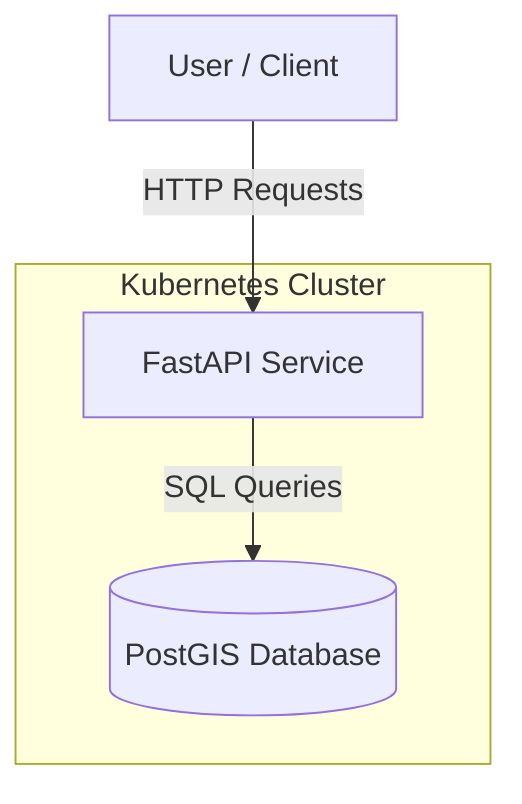
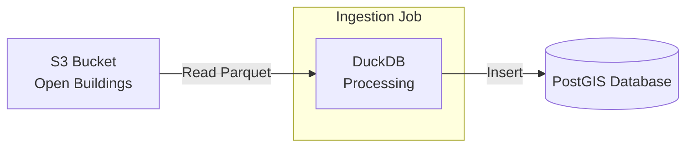

# GeoProject

GeoProject is a geospatial application designed to manage and analyze location data and building footprints. It provides a FastAPI-based REST interface for interacting with geospatial data stored in a PostGIS database.

## Architecture

The application consists of a FastAPI backend service that connects to a PostgreSQL database with PostGIS extensions.



## Data Pipeline

The project includes a data pipeline for ingesting building footprints from S3 (Open Buildings dataset) into the PostGIS database using DuckDB for efficient processing.



## Local Development

### Prerequisites

- Python 3.12+
- Poetry
- Docker (for running PostGIS locally)
- GDAL (system dependencies)

### Setup

1.  **Install Dependencies**:
    ```bash
    poetry install
    ```

2.  **Start PostGIS Database**:
    You can run a local PostGIS instance using Docker:
    ```bash
    docker run --name geoproject-db -e POSTGRES_USER=geoproject_user -e POSTGRES_PASSWORD=password -e POSTGRES_DB=geoproject_db -p 5432:5432 -d postgis/postgis:14-3.4
    ```

3.  **Run the Application**:
    ```bash
    poetry run uvicorn geoproject.main:app --reload
    ```
    The API will be available at `http://localhost:8000`.

### API Endpoints

-   **Locations**: `/api/v1/locations`
-   **Building Footprints**: `/api/v1/building_footprints`
-   **Docs**: `/docs` (Swagger UI)

## Kubernetes Deployment

The application is packaged with a Helm chart located in `geoproject-charts`.

### Prerequisites

-   Kubernetes Cluster
-   Helm 3+
-   `kubectl` configured to talk to your cluster

### Deployment Steps

1.  **Navigate to the charts directory**:
    ```bash
    cd geoproject-charts
    ```

2.  **Install the Chart**:
    ```bash
    helm install my-geoproject .
    ```

3.  **Verify Deployment**:
    ```bash
    kubectl get pods
    kubectl get svc
    ```

### Configuration

You can customize the deployment by modifying the `geoproject-charts/values.yaml` file. Key configurations include:

-   **Image**: Change `app.image.repository` and `app.image.tag` to use your own build.
-   **Database**: The chart includes a sub-chart configuration for PostgreSQL. You can enable/disable it or point to an external database.
    -   To use an external DB, disable the postgresql subchart and provide connection details in `app.env` (you may need to extend the chart to support custom env vars more flexibly if not already present).

### Building the Docker Image

To build and push a new image for the application:

```bash
docker build -t your-repo/geoproject:latest .
docker push your-repo/geoproject:latest
```

Update the `values.yaml` with your new image reference before deploying.
